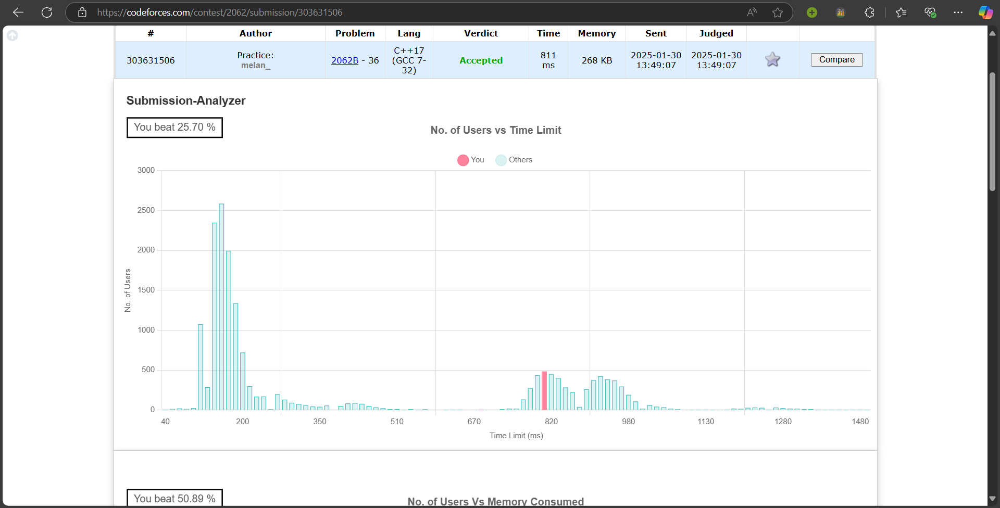
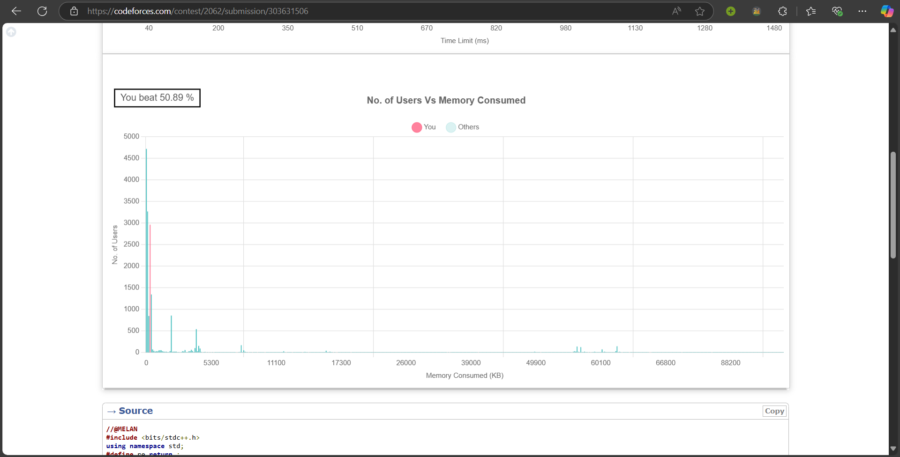
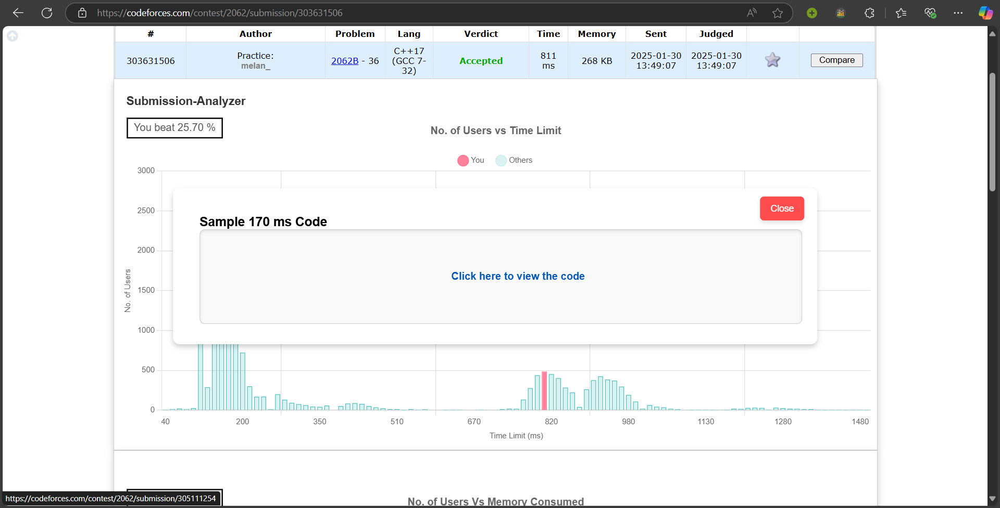

# Codeforces Submission Analyzer

Codeforces Submission Analyzer is a browser extension designed to analyze and visualize Codeforces submissions, including time and memory performance. It allows users to view others' code, compare solutions, and optimize their own code for better efficiency.

---

## Features

- **Performance Visualization**: Generates time and memory graphs to visualize performance trends.
- **OK Submissions**: Fetches and displays details of all "OK" submissions for a problem.
- **Code Popup**: Allows users to view the code of any submission by clicking on a bar in the graph.
- **User-Friendly Interface**: Clean and intuitive popup interface.
- **Cross-Platform**: Works on all Chromium-based browsers (Chrome, Edge, Brave, etc.).

---

## Installation

### Prerequisites
- A Chromium-based browser (e.g., Google Chrome, Microsoft Edge, Brave).
- For Firefox: https://addons.mozilla.org/en-US/firefox/addon/codeforces-submission-analyzer/

### Steps
1. **Download the Extension**:
- Clone this repository or download the ZIP file and extract it.
- ZIP file https://github.com/melan-variya/Codeforces-Submission-Analyzer/releases/tag/v1.0.0
- git clone https://github.com/melan-variya/Codeforces-Submission-Analyzer.git

2. **Load the Extension**:
- Open your browser and go to chrome://extensions/.
- Enable **Developer Mode** (toggle in the top-right corner).
- Click **Load unpacked** and select the folder where you extracted the extension.

3. **Pin the Extension**:
- Click the puzzle icon in the top-right corner of your browser.
- Find **Codeforces-Submission-Analyzer** and pin it to the toolbar.

---

## Usage

1. Navigate to a Codeforces submission page (e.g., https://codeforces.com/contest/123/submission/456).

2. Analyze the time and memory graphs to visualize performance trends.
3. Click on a bar in the graph to view the code of the corresponding submission.

## Screenshots

*Interface showing submission details and performance graphs.*

---

## Technologies Used

- **Frontend**: HTML, CSS, JavaScript
- **Charting Library**: [Chart.js](https://www.chartjs.org/)
- **Codeforces API**: Used to fetch submission data.

---

## Contributing

Contributions are welcome! If you'd like to contribute to this project, please follow these steps:

1. Fork the repository.
2. Create a new branch for your feature or bugfix.
3. Commit your changes and push to the branch.
4. Submit a pull request.

---

## License

This project is licensed under the MIT License. See the [LICENSE](LICENSE) file for details.

---

## Acknowledgments

- Thanks to [Codeforces](https://codeforces.com/) for providing the platform and API.
- Thanks to [Chart.js](https://www.chartjs.org/) for the charting library.

---

## Support

If you encounter any issues or have questions, please [open an issue](https://github.com/melan-variya/Codeforces-Submission-Analyzer/issues) on GitHub.  
If you find this project helpful, please consider starring ⭐ the repository! It helps others discover the project.  

---

**Happy Coding!** 🚀
